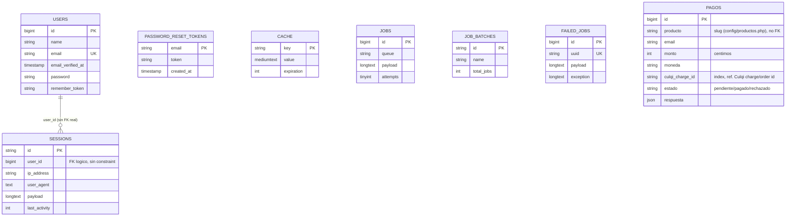
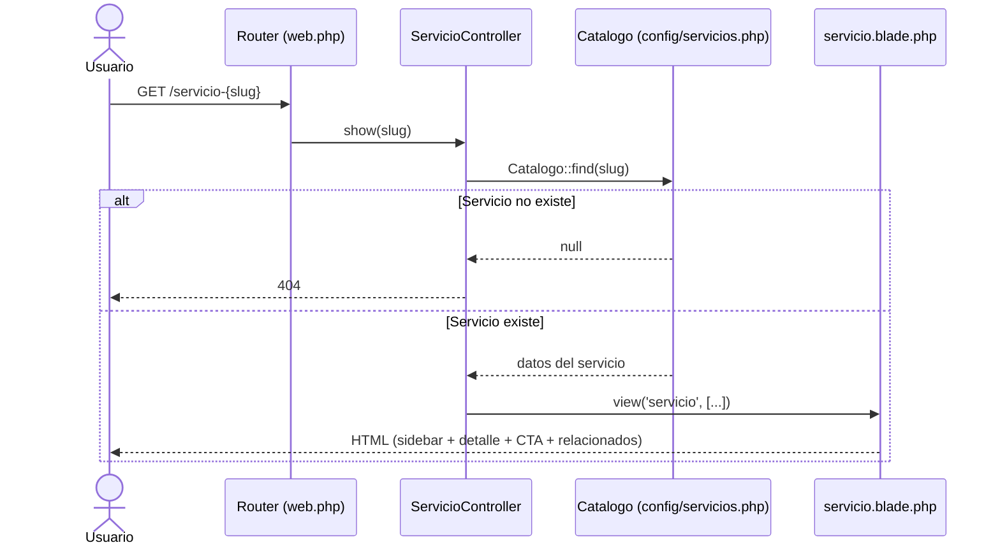
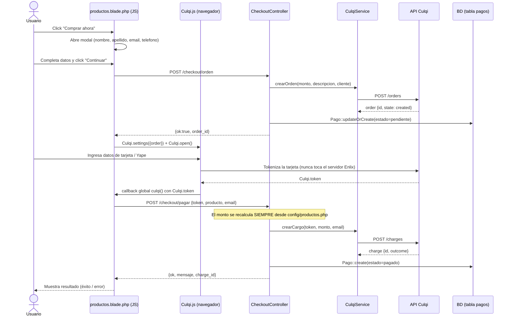
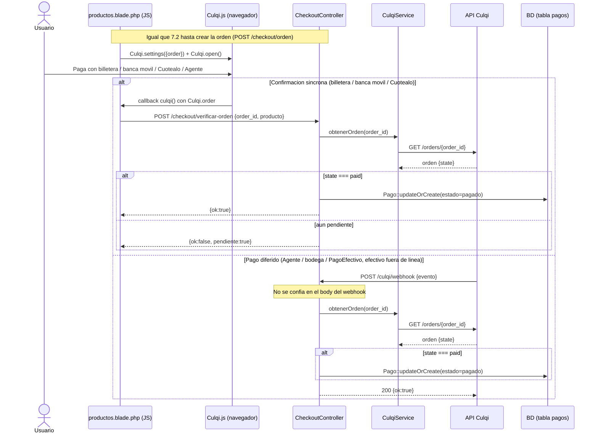

# PROJECT_CONTEXT.md — Enlix (sitio web + tienda Culqi)

> Informe de arquitectura generado por análisis estático del repositorio (solo lectura). Todo lo aquí escrito está basado en el código real citado con `ruta/archivo.php:línea`. Cuando algo no pudo confirmarse en el código, se marca explícitamente como **SUPUESTO** o **NO ENCONTRADO**.
>
> Generado: 2026-09-22. Commits analizados: `4d9ec71 Agrega modulo de productos y pagos con Culqi`, `38c97a9 Proyecto Enlix (Laravel) - version actual`.

---

## 1. RESUMEN GENERAL

**Enlix** es el sitio web corporativo de una empresa peruana (Lima, Perú) de servicios de TI B2B ("Soluciones tecnológicas para empresas"). El sitio tiene dos propósitos:

1. **Vitrina institucional**: presenta la empresa, 15 servicios de TI agrupados en 5 categorías (equipos, soporte, desarrollo, seguridad, consultoría) y datos de contacto (`config/servicios.php`).
2. **Tienda mínima con pago en línea**: 3 "planes web" (productos) que se compran y pagan directamente en el sitio mediante la pasarela peruana **Culqi** (tarjeta, Yape, billeteras, banca móvil, Cuotéalo, agentes/bodegas) (`config/productos.php`, `app/Http/Controllers/CheckoutController.php`).

El problema que resuelve: darle a Enlix presencia web profesional + una forma de cobrar planes web sin necesitar una plataforma de e-commerce completa ni checkout de terceros (Shopify, WooCommerce, etc.).

Comentarios en el código (`app/Support/Catalogo.php:8`, `config/servicios.php:9`) indican que este proyecto **reemplaza un sitio anterior en PHP plano** (`includes/servicios-data.php`), migrado a Laravel.

**Tipo de proyecto**: Monolito Laravel 12, renderizado 100% en servidor con Blade (no es SPA). No expone una API pública (no existe `routes/api.php`); el único tráfico "tipo API" es JSON interno consumido por JavaScript embebido en las propias vistas Blade para el flujo de checkout. No tiene panel de administración.

---

## 2. STACK TECNOLÓGICO

| Categoría | Detalle | Evidencia |
|---|---|---|
| Lenguaje | PHP `^8.2` | `composer.json:9` |
| Framework | Laravel Framework `^12.0` | `composer.json:10` |
| Utilidades Laravel | `laravel/tinker ^2.10.1` | `composer.json:11` |
| Dev/test | `fakerphp/faker`, `laravel/pail`, `laravel/pint`, `laravel/sail`, `mockery/mockery`, `nunomaduro/collision`, `phpunit/phpunit ^11.5.50` | `composer.json:13-21` |
| Base de datos (dev) | SQLite (`DB_CONNECTION=sqlite`), sin `DB_DATABASE` explícito → usa `database_path('database.sqlite')` | `.env.example:23-28`, `config/database.php:20,38` |
| Base de datos (drivers soportados) | mysql, mariadb, pgsql, sqlsrv (config presente pero no usada por defecto) | `config/database.php:47-116` |
| Sesión | Driver `database` | `.env.example:30-34` |
| Caché | Driver `database` | `.env.example:40-41` |
| Colas | Driver `database` (no hay Jobs custom, ver Problemas §11) | `.env.example:38` |
| Correo | Driver `log` (**no hay envío real de correo**, ver Problemas §11) | `.env.example:50-57` |
| Pasarela de pago | **Culqi** (Perú) vía `Illuminate\Support\Facades\Http` (cliente HTTP propio) | `app/Services/CulqiService.php` |
| Checkout cliente | Culqi Checkout **V4** cargado desde CDN (`checkout.culqi.com/js/v4`) | `resources/views/productos.blade.php:129` |
| Frontend CSS/JS real | Bootstrap 5.3.2 vía CDN + `public/assets/css/styles.css` (1692 líneas) + `public/assets/js/enlix.js` (assets estáticos, **no compilados por Vite**) | `resources/views/layouts/app.blade.php:19,20,30,31` |
| Build tool configurado | Vite `^7.0.7` + `laravel-vite-plugin ^2` + `@tailwindcss/vite ^4` + Tailwind `^4` — **configurado pero no usado** por ninguna vista real (ver Problemas §11) | `package.json`, `vite.config.js`, `resources/css/app.css`, `resources/js/app.js` |
| HTTP client JS | `axios` (solo importado en `bootstrap.js`, no se usa activamente — el checkout usa `fetch()` nativo) | `resources/js/bootstrap.js:1-2`, `productos.blade.php:253-263` |
| Storage | Disk `local` por defecto; `public` y `s3` configurados pero sin credenciales (`AWS_*` vacíos) | `config/filesystems.php`, `.env.example:59-63` |
| Otros servicios (no usados) | Postmark, Resend, SES, Slack — presentes en `config/services.php` como stub de Laravel, sin variables de entorno ni código que los invoque | `config/services.php` |

---

## 3. ESTRUCTURA DE CARPETAS

```
enlix/
├── app/
│   ├── Http/Controllers/
│   │   ├── Controller.php            # Clase abstracta base (vacía)
│   │   ├── PageController.php        # Páginas institucionales (inicio/nosotros/contacto)
│   │   ├── ServicioController.php    # Página de detalle de un servicio (slug dinámico)
│   │   └── CheckoutController.php    # Tienda + pago con Culqi (core del negocio)
│   ├── Models/
│   │   ├── User.php                  # Modelo de autenticación (NO usado por ninguna ruta, ver §8)
│   │   └── Pago.php                  # Registro de pagos Culqi (tabla `pagos`)
│   ├── Services/
│   │   └── CulqiService.php          # Cliente HTTP hacia la API de Culqi (cargos, órdenes)
│   ├── Support/
│   │   ├── Catalogo.php              # Lee config/servicios.php (catálogo de servicios)
│   │   └── Producto.php              # Lee config/productos.php (catálogo de productos)
│   └── Providers/
│       └── AppServiceProvider.php    # Comparte $grupos (menú de servicios) a TODAS las vistas
├── bootstrap/
│   ├── app.php                       # Bootstrap Laravel 12 (rutas, exención CSRF del webhook, health check)
│   └── providers.php                 # Registro de AppServiceProvider
├── config/
│   ├── culqi.php                     # Llaves y URL base de Culqi
│   ├── productos.php                 # Catálogo de 3 productos (precios en céntimos)
│   ├── servicios.php                 # Catálogo de 15 servicios en 5 grupos
│   └── ... (app, auth, cache, database, filesystems, logging, mail, queue, services, session — stock Laravel)
├── database/
│   ├── migrations/                   # users, cache, jobs (stock Laravel) + pagos (propia)
│   ├── seeders/DatabaseSeeder.php    # Crea 1 usuario de prueba
│   └── factories/UserFactory.php
├── public/
│   ├── index.php                     # Front controller (entrada HTTP)
│   ├── .htaccess                     # Reescritura Apache hacia index.php
│   └── assets/{css,js,img}/          # CSS/JS/imágenes del sitio real (fuera del pipeline Vite)
├── resources/
│   ├── views/
│   │   ├── layouts/app.blade.php     # Layout HTML principal (usado por TODAS las páginas reales)
│   │   ├── partials/{header,footer,sidebar-servicios}.blade.php
│   │   ├── inicio.blade.php / nosotros.blade.php / contacto.blade.php
│   │   ├── servicio.blade.php        # Plantilla única para las 15 páginas de servicio
│   │   ├── productos.blade.php       # Tienda + lógica JS de checkout Culqi (inline)
│   │   └── welcome.blade.php         # Vista por defecto de Laravel — NO referenciada por ninguna ruta (código muerto)
│   ├── js/{app.js,bootstrap.js}      # Entrada Vite (casi vacía, no usada por el sitio real)
│   └── css/app.css                   # Entrada Tailwind (no usada por el sitio real)
├── routes/
│   ├── web.php                       # Todas las rutas de la aplicación (no hay routes/api.php)
│   └── console.php                   # Comando artisan de ejemplo
├── tests/
│   ├── Feature/ExampleTest.php       # Test stub de Laravel (sin tests reales del negocio)
│   └── Unit/ExampleTest.php          # Test stub de Laravel
├── composer.json / composer.lock
├── package.json / package-lock.json
├── vite.config.js
├── phpunit.xml
└── .env.example
```

**Archivo de entrada HTTP**: `public/index.php:1-20` → `bootstrap/app.php` → `routes/web.php`.
**Convenciones/patrones usados**:
- MVC clásico de Laravel: Controllers finos + Models Eloquent mínimos.
- Patrón **"Support/Catalogo" como capa de datos estática**: en vez de tablas de BD, los catálogos de productos y servicios viven en archivos `config/*.php` y se acceden mediante clases `App\Support\*` con métodos estáticos (`items()`, `find()`). Explícitamente diseñado para "poder migrar a base de datos sin cambiar el resto de la arquitectura" (`app/Support/Producto.php:9`).
- **View Composer global** (`AppServiceProvider.php:24-27`) para inyectar el menú de servicios (`$grupos`) en cualquier vista sin pasarlo manualmente.
- No se usan Form Requests (la validación se hace inline con `$request->validate()` dentro del controlador, ver `CheckoutController.php:35-39`).
- No hay Repositorios, Traits de negocio, Jobs, Events/Listeners ni Policies — la app es intencionalmente pequeña.

---

## 4. BASE DE DATOS

### Tablas (desde migraciones — no hay dump `.sql`)

| Tabla | Migración | Columnas clave | Notas |
|---|---|---|---|
| `users` | `0001_01_01_000000_create_users_table.php:14-22` | `id`, `name`, `email` (unique), `email_verified_at`, `password`, `remember_token`, timestamps | Modelo `User` existe pero **ninguna ruta lo usa** (ver §8) |
| `password_reset_tokens` | mismo archivo:24-28 | `email` (PK), `token`, `created_at` | Stock Laravel, no usado (no hay flujo de reseteo de password) |
| `sessions` | mismo archivo:30-37 | `id` (PK), `user_id` (nullable, indexado, **sin FK real**), `ip_address`, `user_agent`, `payload`, `last_activity` | Usada para sesión/CSRF de todos los visitantes (con o sin login) |
| `cache` / `cache_locks` | `0001_01_01_000001_create_cache_table.php:14-24` | `key` (PK), `value`, `expiration` | Backend del driver de caché `database` |
| `jobs` / `job_batches` / `failed_jobs` | `0001_01_01_000002_create_jobs_table.php:14-45` | ver migración | Backend de colas; **no hay ningún Job definido en `app/`** (tablas sin uso real hoy) |
| `pagos` | `2026_06_25_000000_create_pagos_table.php:11-21` | `id`, `producto` (slug string), `email`, `monto` (unsignedInteger, céntimos), `moneda` (string(3), default `PEN`), `culqi_charge_id` (nullable, indexado), `estado` (string, default `pendiente`: `pendiente`\|`pagado`\|`rechazado`), `respuesta` (json nullable, respuesta cruda de Culqi), timestamps | Tabla central del negocio de pagos |

### Relaciones

- `sessions.user_id` apunta conceptualmente a `users.id`, pero se define solo como columna indexada (`$table->foreignId('user_id')->nullable()->index()`), **sin `->constrained()`** → no hay integridad referencial real a nivel de BD.
- `pagos.producto` guarda el **slug** del producto (string), no un FK — porque los productos **no están en base de datos**, viven en `config/productos.php`.
- **No existen relaciones Eloquent** (`hasMany`/`belongsTo`/etc.) en `App\Models\User` ni `App\Models\Pago` — se confirmó leyendo ambos modelos completos.
- `pagos` es una tabla **independiente**, sin FK hacia `users` (los pagos son de invitado/guest, identificados solo por `email`).

### Diagrama ER (Mermaid)



> `PAGOS` se dibuja sin relación porque, efectivamente, **no tiene ninguna FK** hacia otra tabla del sistema.

### Seeders / datos iniciales

- `database/seeders/DatabaseSeeder.php:20-23`: crea un único usuario de prueba `Test User <test@example.com>` vía `UserFactory`.
- No hay seeder para `pagos` (no aplica, son transaccionales).
- El catálogo de productos/servicios **no se siembra**: es config estático (`config/productos.php`, `config/servicios.php`), versionado en git.

---

## 5. RUTAS Y ENDPOINTS

Todas las rutas están en `routes/web.php` (no existe `routes/api.php`). No hay prefijos `/admin` ni `/api`; no hay rutas "públicas vs. protegidas" porque **ninguna ruta requiere autenticación** (ver §8).

| Método | URL | Controlador@método | Middleware | Qué hace |
|---|---|---|---|---|
| GET | `/` | `PageController@inicio` | `web` | Página de inicio institucional |
| GET | `/nosotros` | `PageController@nosotros` | `web` | Página "Quiénes somos" |
| GET | `/contacto` | `PageController@contacto` | `web` | Página de contacto (enlaces WhatsApp/email/mapa, sin formulario POST) |
| GET | `/productos` | `CheckoutController@index` | `web` | Lista los 3 productos + expone la llave pública de Culqi |
| POST | `/checkout/pagar` | `CheckoutController@pagar` | `web` (CSRF) | Cobra con token de tarjeta/Yape (cargo inmediato) |
| POST | `/checkout/orden` | `CheckoutController@crearOrden` | `web` (CSRF) | Crea una orden Culqi (billeteras/banca móvil/Cuotéalo/agentes) |
| POST | `/checkout/verificar-orden` | `CheckoutController@verificarOrden` | `web` (CSRF) | Verifica si una orden ya fue pagada (confirmación síncrona) |
| POST | `/culqi/webhook` | `CheckoutController@webhook` | `web`, **CSRF exento** (`bootstrap/app.php:14-17`) | Webhook de Culqi: confirma pagos diferidos (agente/bodega/PagoEfectivo) |
| GET | `/servicio-{slug}` | `ServicioController@show` | `web`, `slug` regex `[a-z0-9-]+` | Página de detalle de 1 de los 15 servicios |
| GET | `/up` | (framework, `bootstrap/app.php:11`) | — | Health check estándar de Laravel |

Fuente exacta: `routes/web.php:8-24`.

**No hay rutas de autenticación** (`login`, `register`, `dashboard`, etc.) — no están definidas en ningún archivo de rutas ni provider. `resources/views/welcome.blade.php:24,28` referencia `route('login')` y `url('/dashboard')`, pero como esa vista no está enlazada a ninguna ruta, es código muerto (ver §11).

---

## 6. MÓDULOS Y FUNCIONALIDADES

### 6.1 Páginas institucionales
- **Qué hace**: sirve Home, Nosotros y Contacto como contenido estático (sin BD).
- **Archivos**: `app/Http/Controllers/PageController.php`, `resources/views/inicio.blade.php`, `nosotros.blade.php`, `contacto.blade.php`.
- **Reglas de negocio**: ninguna; solo pasa `titulo` y `current` (para resaltar el ítem activo del menú) a la vista.
- **Validaciones**: no aplica (no hay input de usuario; el "formulario de contacto" en realidad son enlaces `mailto:` y `wa.me` — no hay POST a servidor, ver `contacto.blade.php:30-38,57,70`).

### 6.2 Catálogo de servicios
- **Qué hace**: expone 15 servicios agrupados en 5 categorías (equipos, soporte, desarrollo, seguridad, consultoría), cada uno con su propia URL `/servicio-{slug}`.
- **Archivos**: `app/Http/Controllers/ServicioController.php`, `app/Support/Catalogo.php`, `config/servicios.php` (fuente de datos, 342 líneas), `resources/views/servicio.blade.php`, `resources/views/partials/sidebar-servicios.blade.php`.
- **Reglas de negocio**:
  - `Catalogo::find($slug)` devuelve `null` si el slug no existe → `abort_if($svc === null, 404)` (`ServicioController.php:18`).
  - `Catalogo::grupos()` arma el árbol de navegación en el **orden fijo** definido en `servicios.orden` (`Catalogo.php:29-57`).
  - `Catalogo::otrosDelGrupo()` muestra servicios relacionados (mismo grupo, excluyendo el actual) al final de cada página (`Catalogo.php:60-76`).
- **Validaciones**: el slug se restringe por regex de ruta `[a-z0-9-]+` (`routes/web.php:23`); no hay validación adicional porque no hay input de formulario en este módulo.

### 6.3 Tienda + Checkout con Culqi (módulo central del negocio)
- **Qué hace**: vende 3 "planes web" y cobra con Culqi soportando tarjeta, Yape, billeteras, banca móvil, Cuotéalo y agentes/bodegas (pago en efectivo diferido).
- **Archivos**:
  - Backend: `CheckoutController.php`, `app/Services/CulqiService.php`, `app/Models/Pago.php`, `app/Support/Producto.php`, `config/productos.php`, `config/culqi.php`.
  - Frontend: `resources/views/productos.blade.php` (incluye ~155 líneas de JavaScript inline con la integración de Culqi Checkout V4).
- **Reglas de negocio críticas**:
  - **El precio SIEMPRE se toma del servidor** (`config/productos.php`), nunca del cliente — así el navegador no puede alterar el monto a cobrar (`CheckoutController.php:47-48`, comentario explícito en `config/productos.php:11-13`).
  - **El webhook nunca confía en el payload recibido**: ante cualquier evento, vuelve a consultar el estado real de la orden a la API de Culqi con la *secret key* y solo marca el pago como `pagado` si Culqi confirma `state === 'paid'` (`CheckoutController.php:214-216, 235-247`). Esto neutraliza webhooks falsificados.
  - El registro en BD es **best-effort**: si falla el guardado en `pagos`, el cargo ya fue procesado igual y la respuesta al usuario no se rompe — solo se loguea el warning (`CheckoutController.php:73-86,143-156,260-281`).
  - Idempotencia por `culqi_charge_id` vía `Pago::updateOrCreate` (`CheckoutController.php:144-153, 275-278`) — tanto la verificación síncrona como el webhook pueden marcar el mismo pago sin duplicarlo.
- **Validaciones** (Laravel `$request->validate()` inline):
  - `pagar()`: `token` (string requerido), `producto` (string requerido), `email` (email requerido) — `CheckoutController.php:35-39`.
  - `crearOrden()`: `producto`, `first_name`, `last_name` (max 50), `email`, `phone_number` (max 20), todos requeridos — `CheckoutController.php:101-107`.
  - `verificarOrden()`: `order_id`, `producto`, requeridos — `CheckoutController.php:171-174`.
  - En los tres casos, si el producto no existe en `config/productos.php` se responde `404` (`CheckoutController.php:43-45,111-113,178-180`).

### 6.4 Layout y componentes compartidos
- **Qué hace**: header con menú (incluye submenú "flyout" de servicios), footer con enlaces de servicios/contacto/WhatsApp flotante, y el layout base que todas las páginas extienden.
- **Archivos**: `resources/views/layouts/app.blade.php`, `partials/header.blade.php`, `partials/footer.blade.php`, `AppServiceProvider.php`.
- **Mecanismo clave**: `AppServiceProvider::boot()` registra un View Composer global (`View::composer('*', ...)`) que inyecta `$grupos` (el árbol de servicios) en **todas** las vistas, por eso el header/footer pueden usarlo sin que cada controlador lo pase explícitamente (`AppServiceProvider.php:24-27`).

---

## 7. FLUJOS DE PRINCIPIO A FIN

### 7.1 Navegación institucional y páginas de servicio

Usuario → `layouts/app.blade.php` (vía `@extends`) → ruta `web` (sin middleware de auth) → Controller (`PageController` o `ServicioController`) → para servicios, `Catalogo::find()` lee `config/servicios.php` → vista Blade → HTML.



*(Home, Nosotros y Contacto siguen el mismo patrón simplificado: Router → `PageController` → vista, sin capa de datos intermedia.)*

### 7.2 Compra con tarjeta o Yape (token — cargo inmediato)



### 7.3 Compra con billetera / banca móvil / Cuotéalo / agente (orden + verificación + webhook)



---

## 8. AUTENTICACIÓN Y ROLES

**No hay autenticación activa en la aplicación.**

- Existe el andamiaje estándar de Laravel: tabla `users`, modelo `App\Models\User`, `config/auth.php` (guard `web`, provider `eloquent`), `password_reset_tokens`, `UserFactory`.
- Pero **ninguna ruta** usa `auth`, `guest` ni ningún otro middleware de autenticación (`routes/web.php` completo revisado — cero referencias a `Auth::`, `middleware('auth')`, `Route::group`, etc.).
- No hay controladores de login/registro, ni paquete de scaffolding instalado (no está Breeze, Jetstream ni Fortify en `composer.json`).
- El único uso real de `users`/sesiones es el genérico de Laravel: cookie de sesión + CSRF para cualquier visitante (no requiere estar "logueado").
- **No existen roles ni permisos** (no hay Gates, Policies, ni columna de rol en `users`).
- Todas las rutas —incluidas las de checkout y el webhook— son **públicas**. La única protección real del dinero es que el **precio se calcula en servidor** (§6.3) y que el webhook **re-verifica contra la API de Culqi** en vez de confiar en el request entrante.

**Conclusión**: el módulo de auth de Laravel está presente pero **sin usar** — es candidato a eliminarse o a activarse si en el futuro se necesita un panel de administración (ver Problemas §11 y Mapa mental §12).

---

## 9. CONFIGURACIÓN Y DESPLIEGUE

### 9.1 Variables de entorno (de `.env.example`, sin valores reales)

| Variable | Propósito |
|---|---|
| `APP_NAME`, `APP_ENV`, `APP_KEY`, `APP_DEBUG`, `APP_URL` | Config básica de Laravel. **`APP_KEY` debe generarse** (`php artisan key:generate`) |
| `APP_LOCALE`, `APP_FALLBACK_LOCALE`, `APP_FAKER_LOCALE` | Localización (por defecto en inglés, ver Problemas §11) |
| `LOG_CHANNEL`, `LOG_STACK`, `LOG_LEVEL` | Logging |
| `DB_CONNECTION`, `DB_HOST`, `DB_PORT`, `DB_DATABASE`, `DB_USERNAME`, `DB_PASSWORD` | Conexión a base de datos (sqlite por defecto en dev) |
| `SESSION_DRIVER`, `SESSION_LIFETIME`, `SESSION_ENCRYPT` | Sesión |
| `QUEUE_CONNECTION`, `CACHE_STORE` | Colas / caché |
| `MAIL_MAILER`, `MAIL_HOST`, `MAIL_PORT`, `MAIL_USERNAME`, `MAIL_PASSWORD`, `MAIL_FROM_ADDRESS`, `MAIL_FROM_NAME` | Correo saliente (**sin proveedor real configurado**, ver §11) |
| `AWS_ACCESS_KEY_ID`, `AWS_SECRET_ACCESS_KEY`, `AWS_DEFAULT_REGION`, `AWS_BUCKET` | Storage S3 (opcional, no usado) |
| `CULQI_PUBLIC_KEY`, `CULQI_SECRET_KEY`, `CULQI_BASE_URL`, `CULQI_CURRENCY` | **Credenciales de la pasarela de pago** — la pública se usa en el navegador, la secreta solo en backend (`config/culqi.php:19-25`) |

### 9.2 Levantar el proyecto en local (desde cero)

1. `composer install`
2. `cp .env.example .env` (o dejar que `composer run setup` lo haga)
3. `php artisan key:generate`
4. Base de datos: por defecto SQLite → crear el archivo vacío `database/database.sqlite` (el `.gitignore` de `database/` ignora `*.sqlite*`, así que no viene versionado — **NO ENCONTRADO** en el repo, hay que crearlo a mano o dejar que el script `post-create-project-cmd` lo haga)
5. `php artisan migrate` (crea `users`, `sessions`, `cache`, `jobs`, `pagos`, etc.)
6. Configurar `CULQI_PUBLIC_KEY` / `CULQI_SECRET_KEY` de **sandbox** (`pk_test_...` / `sk_test_...`) en `.env` para poder probar pagos sin cobrar dinero real (`.env.example:67-73`)
7. `npm install && npm run build` — **opcional para el sitio real** (los assets reales están en `public/assets/`, no dependen de Vite; solo es necesario si se toca `welcome.blade.php` o se decide migrar el CSS/JS al pipeline Vite/Tailwind)
8. Levantar: `php artisan serve`, o usar el script combinado `composer run dev` que levanta servidor + `queue:listen` + `pail` (logs) + `vite` en paralelo (`composer.json:43-46`)

Todo esto está soportado por los scripts ya definidos en `composer.json:35-42` (`composer run setup`) y `composer.json:43-46` (`composer run dev`).

### 9.3 Despliegue en producción

**NO ENCONTRADO** en el repositorio: no hay carpeta `.github/workflows` (CI/CD), no hay `Dockerfile`/`docker-compose`, no hay script de deploy (Envoyer, Forge, Deployer), no hay documentación de hosting. Todo lo siguiente es **SUPUESTO**, basado en patrones típicos de un Laravel desplegado en hosting compartido/cPanel (común para sitios institucionales peruanos como este), no en evidencia del repositorio:

- `git pull` en el servidor (o subir el ZIP vía cPanel File Manager).
- `composer install --no-dev --optimize-autoloader`.
- `npm ci && npm run build` (solo si se decide usar el pipeline Vite en producción; hoy no es estrictamente necesario porque el sitio real no depende de `public/build/`).
- Configurar `.env` de producción con `APP_ENV=production`, `APP_DEBUG=false`, credenciales de BD reales y **llaves Culqi `pk_live_`/`sk_live_`**.
- `php artisan migrate --force`.
- `php artisan config:cache && php artisan route:cache && php artisan view:cache`.
- Configurar el **document root apuntando a `public/`** (requisito de cualquier despliegue Laravel; en cPanel típicamente se usa un symlink o "Setup Node/PHP App").
- Cron para `php artisan schedule:run` cada minuto (aunque hoy `routes/console.php` no define ningún schedule real, es buena práctica dejarlo listo).
- Un worker de colas (`php artisan queue:work`) **si en el futuro se agregan Jobs** — hoy no hay ninguno, así que no es indispensable.
- Registrar la URL pública `https://.../culqi/webhook` en el panel de Culqi para que los pagos diferidos (agente/bodega) se confirmen automáticamente.

---

## 10. INTEGRACIONES EXTERNAS

| Integración | Dónde se configura | Dónde se usa | Notas |
|---|---|---|---|
| **Culqi** (pasarela de pago) | `config/culqi.php`, variables `CULQI_*` en `.env` | `app/Services/CulqiService.php` (backend, API REST vía `Http::withToken()`); `resources/views/productos.blade.php:129,143` (Culqi Checkout V4 JS en el navegador) | Único proveedor de pagos. Backend usa *secret key*, frontend usa *public key* |
| Culqi Checkout V4 (CDN) | — | `<script src="https://checkout.culqi.com/js/v4">` en `productos.blade.php:129` | Widget de pago embebido |
| Webhook de Culqi | Ruta `/culqi/webhook`, exenta de CSRF en `bootstrap/app.php:14-17` | `CheckoutController@webhook` | Confirma pagos diferidos (agentes/bodegas/PagoEfectivo) |
| Bootstrap 5.3.2 (CDN) | — | `layouts/app.blade.php:19,30` | CSS y JS del framework UI, sin build local |
| Google Fonts (CDN) | — | `layouts/app.blade.php:15-17` | Tipografías Inter/Montserrat |
| Google Maps (embed) | — | `contacto.blade.php:161-167` | Iframe estático con la ubicación de la oficina |
| WhatsApp (`wa.me`) | — | `footer.blade.php:83-92`, `contacto.blade.php:30-38,148-153` | Enlaces directos, no es una API integrada |
| Imágenes externas (Unsplash, simpleicons.org) | — | `config/servicios.php` (campo `image`), `inicio.blade.php` (logos de marcas) | *Hotlinking* a servicios de terceros, ver Problemas §11 |
| Correo (SMTP/Postmark/SES/Resend) | `config/mail.php`, `config/services.php` | **No usado en código** — ningún Mailable/Notification implementado | Ver Problemas §11 (crítico funcional) |
| AWS S3 | `config/filesystems.php:50-61` | No usado (sin credenciales) | Configurado por defecto de Laravel, inactivo |
| Slack notifications | `config/services.php:31-36` | No usado | Stub de Laravel, sin variables de entorno ni código |

---

## 11. PROBLEMAS DETECTADOS

### 🔴 Crítico
Ninguno detectado que comprometa directamente dinero o datos sensibles. El diseño del flujo de pago es, en general, sólido (precio autoritativo en servidor + re-verificación del webhook contra la API de Culqi en vez de confiar en el payload — `CheckoutController.php:214-247`).

### 🟠 Alto

1. **Promesa de envío de correo sin implementación real.** El usuario recibe el mensaje *"Te enviaremos los detalles a tu correo"* tanto en pago con tarjeta (`CheckoutController.php:90`) como en verificación de orden (`CheckoutController.php:206`), pero **no existe ningún Mailable, Notification, ni llamada a `Mail::`/`Notification::` en todo el proyecto** (`MAIL_MAILER=log` en `.env.example:50`). El cliente nunca recibirá ese correo. Impacto: promesa incumplida al usuario final que pagó.
2. **Cero rate limiting en los endpoints de checkout y en el webhook.** `POST /checkout/pagar`, `/checkout/orden`, `/checkout/verificar-orden` y `/culqi/webhook` no tienen middleware `throttle` (`routes/web.php:14-19`, `bootstrap/app.php` solo configura la excepción CSRF, no agrega ningún limitador). Cualquiera puede automatizar llamadas y: (a) forzar al backend a hacer llamadas repetidas a la API de Culqi (costo/latencia, posible bloqueo por parte de Culqi), (b) usar `/checkout/verificar-orden` o `/culqi/webhook` para sondear el estado de `order_id` arbitrarios.
3. **Cero cobertura de pruebas del negocio real.** `tests/Feature/ExampleTest.php` y `tests/Unit/ExampleTest.php` son los stubs por defecto de Laravel (`assertStatus(200)` sobre `/`, y `assertTrue(true)`). No hay ningún test de `CheckoutController`, `CulqiService`, `Catalogo` ni `Producto`, a pesar de que este módulo mueve dinero real.

### 🟡 Medio

4. **Pipeline Vite/Tailwind configurado pero no usado por el sitio real.** `package.json`, `vite.config.js`, `resources/css/app.css` y `resources/js/app.js` están listos para compilar Tailwind 4, pero **ninguna vista real los referencia** — `layouts/app.blade.php` carga Bootstrap por CDN y `public/assets/{css,js}/*` directamente (`layouts/app.blade.php:19,20,30,31`). El único archivo que usa `@vite` es `resources/views/welcome.blade.php:14-16`, que a su vez no está enlazado a ninguna ruta. Esto genera dependencias y configuración muertas que confunden a cualquier desarrollador nuevo.
5. **`welcome.blade.php` es código muerto.** No hay ninguna ruta que la sirva (confirmado por búsqueda exhaustiva en `routes/` y `app/`); referencia rutas inexistentes (`route('login')`, `/dashboard`).
6. **Información de contacto duplicada y hardcodeada** (teléfono `963 885 176`, `servicios@enlix.pe`, enlace de LinkedIn) en al menos `footer.blade.php:62-64,83-92` y `contacto.blade.php:30,57,70,82,148-153`, sin una fuente única de verdad (podría vivir en un `config/empresa.php` como ya se hizo con servicios/productos).
7. **Estilos inline duplicados por vista** — `productos.blade.php:5-37` define un bloque `<style>` completo dentro del Blade en vez de centralizarlo en `public/assets/css/styles.css`, generando deuda de mantenimiento de CSS repartida en dos sitios.
8. **`sessions.user_id` sin constraint de FK real** (`0001_01_01_000000_create_users_table.php:32` usa `->index()` sin `->constrained()`) — es el stub por defecto de Laravel, bajo riesgo real hoy porque `users` casi no se usa, pero quedaría expuesto si se activa autenticación.
9. **README y metadatos del proyecto sin actualizar**: `composer.json:3` sigue con `"name": "laravel/laravel"` y `README.md` es el genérico del framework, sin ninguna mención a Enlix — dificulta el onboarding y la identificación del proyecto en herramientas (Packagist, dashboards internos, etc.).
10. **Localización en inglés por defecto**: `.env.example:7-9` define `APP_LOCALE=en` / `APP_FAKER_LOCALE=en_US` para un sitio 100% en español — inconsistencia de configuración (bajo impacto porque no hay strings traducidos vía `__()` en el proyecto, todo el texto está hardcodeado en español directamente en los Blade).

### 🟢 Bajo

11. **Dependencia de imágenes externas (*hotlinking*)** a Unsplash y `cdn.simpleicons.org` en `config/servicios.php` (campo `image` en cada servicio) e `inicio.blade.php` (logos de marcas) — si esos servicios cambian o eliminan las imágenes, o agregan límites de uso, se rompe el diseño; también añade una dependencia de disponibilidad de terceros a la carga de cada página.
12. **Doble stack de UI** (Bootstrap 5 realmente usado + Tailwind 4 instalado sin usar) infla el `node_modules`/tiempo de build sin necesidad, relacionado con el hallazgo #4.
13. **Falta de `FormRequest` classes**: la validación vive inline en el controlador (`CheckoutController.php:35-39,101-107,171-174`) — funciona bien a esta escala, pero si el checkout crece, sería más limpio extraerla a Form Requests dedicados.
14. **JS de checkout 100% inline en Blade** (`productos.blade.php:127-283`, ~155 líneas) en vez de un archivo JS separado versionado/lintable — dificulta testear o reutilizar esa lógica.

---

## 12. MAPA MENTAL PARA OTRO DESARROLLADOR

Lo mínimo que alguien nuevo necesita saber para trabajar hoy en este proyecto:

1. **Es un Laravel 12 "vainilla" sin API ni SPA** — todo se renderiza con Blade en el servidor. No busques `routes/api.php`, no existe.
2. **Los "productos" y "servicios" NO están en la base de datos** — están hardcodeados en `config/productos.php` y `config/servicios.php`. Si necesitas agregar/editar un servicio o plan, edita esos archivos, no busques un CRUD ni un admin.
3. **La única tabla de negocio real es `pagos`** — todo lo demás (`users`, `sessions`, `cache`, `jobs`) es andamiaje estándar de Laravel, en gran parte sin usar hoy.
4. **No hay login ni panel admin.** Si te piden agregar uno, tendrás que conectar el `auth.php`/`User` existente (están ahí pero inactivos) a rutas y middleware nuevos.
5. **El CSS/JS real del sitio vive en `public/assets/`, NO en `resources/`.** Vite/Tailwind están instalados pero el sitio en producción no los usa — antes de "arreglar algo en Tailwind", confirma si esa vista realmente carga `@vite` (solo `welcome.blade.php` lo hace, y esa vista es inalcanzable).
6. **El checkout es el corazón del negocio** (`CheckoutController.php` + `CulqiService.php`): el precio SIEMPRE sale de `config/productos.php` en servidor, nunca confíes en montos que llegan del navegador. Si tocas este flujo, no rompas esa garantía.
7. **El webhook de Culqi (`/culqi/webhook`) no confía en su propio payload** — siempre vuelve a consultar la API de Culqi antes de marcar un pago como pagado. Mantén ese patrón si agregas más eventos.
8. **No se envían correos reales todavía** — si el negocio depende de confirmar pagos por email, ese es el primer hueco funcional a cerrar (`MAIL_MAILER=log`).
9. **Para desarrollar el checkout en local, usa llaves Culqi de sandbox** (`pk_test_...` / `sk_test_...`) — nunca pruebes con llaves `_live_`.
10. **No hay tests del negocio** — antes de refactorizar `CheckoutController`/`CulqiService`, considera escribir al menos tests de Feature que mockeen la API de Culqi (`Http::fake()`), porque hoy cualquier cambio ahí es "a ciegas".

---

*Fin del informe. Este archivo puede reutilizarse como contexto persistente en futuras sesiones de trabajo sobre el repositorio `enlix`.*
